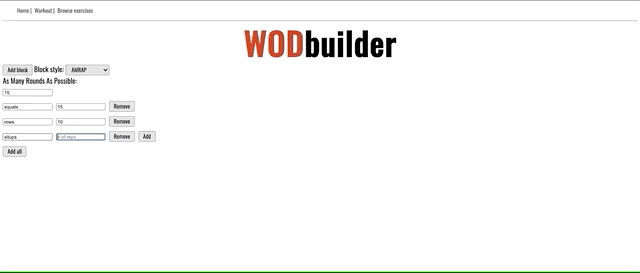

> Welcome to WODcoach workout generator

WODCoach is a workout web application that enables users to create custom workout routines. Users can add workout blocks from a menu of options, including EMOM, RFT, Tabata, AMRAP and Conventional.
_______________________



# Tech Stack

WODcoach uses a number of open source projects to work properly:

##### Front End

- [React] - A JavaScript library for building user interfaces
- [React Router] - Declarative Routing for React

##### Back End

- [node.js] - Node.js is a JavaScript runtime built on Chrome's V8 JavaScript engine.
- [Express] - fast node.js network app framework

##### Testing And Deployment

- [AWS] - Amazon Web Services offers reliable, scalable, and inexpensive cloud computing services.

##### Developer Tools

- [WebPack] - Webpack is a module bundler. Its main purpose is to bundle JavaScript files for usage in a browser.
- [Babel] - The compiler for next generation JavaScript
- [NPM] - An all in one package manager.

##### API

- [Axios] - Promise based HTTP client for the browser and node.js

### Installation

Install the dependencies and devDependencies and start the server.

```sh
$ cd WODcoach
$ npm run build
$ npm run start
Go to localhost:4040/
```
